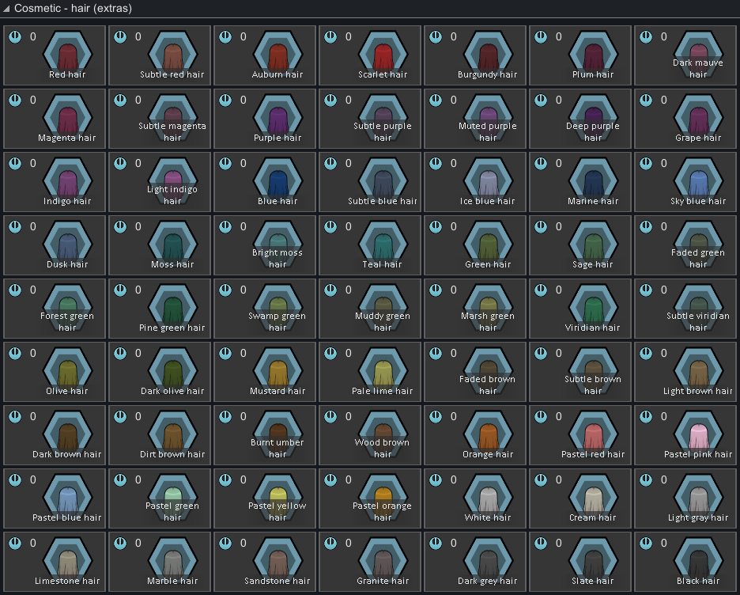

<!--  -->
[requirements]: https://img.shields.io/badge/dynamic/xml?url=https%3A%2F%2Fraw.githubusercontent.com%2FRimCorePlus%2FGenes%2Frefs%2Fheads%2Fmain%2FAbout%2FAbout.xml&query=%2F%2FdisplayName&style=for-the-badge&label=Requires&color=mediumpurple
<!-- [![GPLv3][badge-license]](https://www.gnu.org/licenses/gpl-3.0) -->
[badge-license]: https://img.shields.io/badge/License-GPLv3-lightgray?style=for-the-badge

# [RCP] Genes
\
![Requirements][requirements] [![GPLv3][badge-license]](https://www.gnu.org/licenses/gpl-3.0)

> [!IMPORTANT]
> Requires [RimWorld Biotech](https://store.steampowered.com/app/1826140/RimWorld__Biotech/).\
> Requires [XML Extensions](https://steamcommunity.com/sharedfiles/filedetails/?id=2574315206).\
> Integrated with [AFU Cosmetic Gene Expanded](https://steamcommunity.com/sharedfiles/filedetails/?id=2880942803) (optional).\
> Integrated with [EBSG Framework](https://steamcommunity.com/sharedfiles/filedetails/?id=3112549163) (optional).

## Additions
### Hair Color Genes
This mod adds 63 hair colors from the RimWorld color palette. These can be disabled in the settings.

There's an option to make non-realistic hair colors more common as well. This setting can be enabled with or without the new hair colors enabled.

## Options
### Remove Vanilla Xenotypes
Vanilla xenotypes (excl. sanguophage) can be removed from pawn generation by removing them from every xenotypeChances list and setting factionlessGenerationWeight to 0. They can still be created by the character at game start and selected in the xenotype menu. These settings should be enabled before world generation.

Dirtmoles, genies, highmates, and hussars can be toggled off on an existing save. Removing impids, neanderthals, pigskins, wasters, and yttakin from an existing save is not recommended if their factions are in the world. Removing wasters will always cause a harmless DefOf red error on startup.

### Misc Changes
- Highmates Are Capable of Violence
- Lovely Feline Highmates (requires AFU Cosmetic Gene Expanded)
- Standard Body Highmates
- Butchering Piggers Yields Pork (requires EBSG Framework)
- Standard Body Piggers

## Legal
Portions of the materials used to create this mod are trademarks and/or copyrighted works of Ludeon Studios Inc. All rights reserved by Ludeon. This mod is not official and is not endorsed by Ludeon.