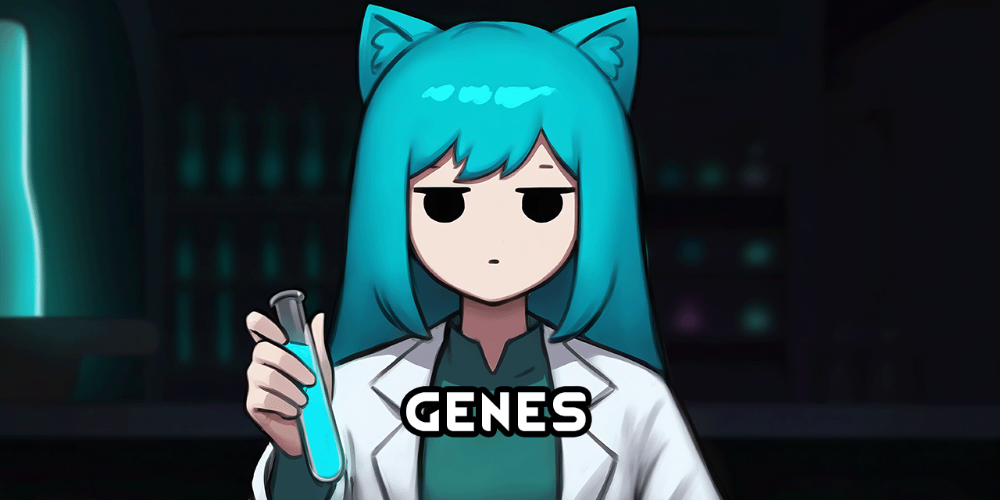

<!--[![GPLv3][badge-license]](https://www.gnu.org/licenses/gpl-3.0) -->
[badge-license]: https://img.shields.io/badge/License-GPLv3-lightgray
<!--![Supports Royalty][badge-dlc-royalty] supports Royalty DLC-->
[badge-dlc-royalty]: https://img.shields.io/badge/DLC-Royalty-gold
<!--![Supports Ideology][badge-dlc-ideology] supports Ideology DLC-->
[badge-dlc-ideology]: https://img.shields.io/badge/DLC-Ideology-indianred
<!--![Supports Biotech][badge-dlc-biotech] supports Biotech DLC-->
[badge-dlc-biotech]: https://img.shields.io/badge/DLC-Biotech-mediumturquoise
<!--![Supports Anomaly][badge-dlc-anomaly] supports Anomaly DLC-->
[badge-dlc-anomaly]: https://img.shields.io/badge/DLC-Anomaly-darkseagreen

# [Core+] Genes
\
[![GPLv3][badge-license]](https://www.gnu.org/licenses/gpl-3.0) ![Supports Biotech][badge-dlc-biotech]

Scope of this mod:
- Add new genes to be used by my xenotype mods
- Rebalance existing xenotypes

> [!IMPORTANT]
> Requires [Vanilla Expanded Framework](https://steamcommunity.com/sharedfiles/filedetails/?id=2023507013).

## Changes
- Adds new eye colors (currently violet,and green)
- Adds always male and always female genes
- Adds taming and training buffs to animal genes
- Removes all genetic aptitudes
- Removes dirtmole, genie, hussar, neanderthal, pigskin, yttakin
- Gives sanguophage red eyes
- Flatten gene complexity (disabled by default)
- Flatten metabolic efficiency (disabled by default),and yttakin xenotypes
- Reworks highmate, impid, and wasters

## Legal
Portions of the materials used to create this mod are trademarks and/or copyrighted works of Ludeon Studios Inc. All rights reserved by Ludeon. This mod is not official and is not endorsed by Ludeon.